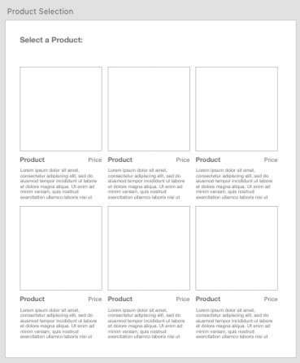
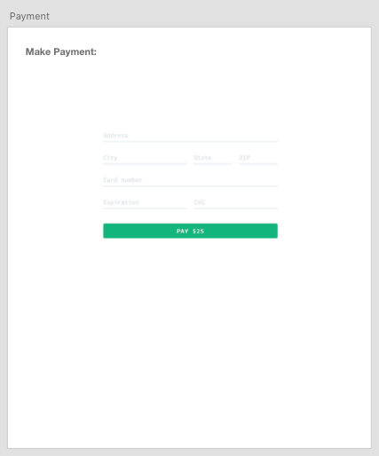
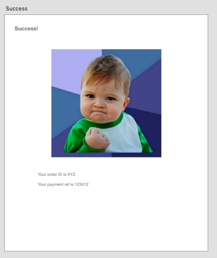

# Tinybeans Project

## Setup
This repository is setup using the following technologies:
- Spring boot
- MySQL 5.x
- Java 11 
- Docker Desktop
- Docker and docker compose (Ubuntu specific)

## How to run it
This repo is setup using docker containers with docker-compose. To run it properly you will need to create a `.env` file in main directory, copy paste the `.env.template` into `.env` and replace the env variables according to your setup.

To start the app simply run the command

`docker-compose up --build`

NOTE: ports 3306 & 8080 must be available for it to run

After startup you can test that Spring Boot is running by going to `http://localhost:8080` and if opting to use react you can verify its up and running by going to `http://localhost:3000/`

## Requirements
1. Customer can see a list of products.
2. Customer can select a product to purchase.
3. Customer want to pay for the product with credit card.
4. Customer want to see confirmation that I’ve paid for the product.

## Backend
### Models
1. Product
2. Order
3. Item

All proper validations has been applied on fields.

### API(s)
#### Product:
1. `GET /api/v1/product` gets all the product present in DB.
2. `GET /api/v1/product/{id}` gets product specific to this id

#### Order:
1. `POST /api/v1/orders` create a new object of order
2. `GET /api/v1/orders/{id}` gets a specific order and it's items corresponding to this id

#### Payment:
1. `POST /api/v1/transaction/stripe/{amount}` creates a payment intent for a specified amount

#### Order Items:
1. `GET /api/v1/items` Retrieve all items
2. `GET /api/v1/items/{id}` Retrieve an item by this id

## Frontend
### Local Setup without docker
Please run the following:
1. npm i
2. npm start

This will start the application and you can access it on the port 3000.

### Screens
#### Product screen

A model object for products has already been created. When the user clicks on a product it should take him to the checkout screen

#### Checkout screen

When a user selects a product, that will get added to their cart, and the user can then place their order on this screen when ready to check out.

For this I have used **Stripe** as a payment platform.

#### Success screen

Once checkout has completed, an order is successfully placed it saves the details so we can review later. A model object for an order has already been created.

The success screen should contain the Order ID and any reference to the payment made through the provider you chose in the checkout screen.

## Assumptions and Trade-offs:
1. Due to the restriction of time, I wasn't able to add the test coverage in it.
2. I haven't considered any roles in the current scenario due to the restriction of time.
3. Currently, an order only consist of an item as per the requirement.

